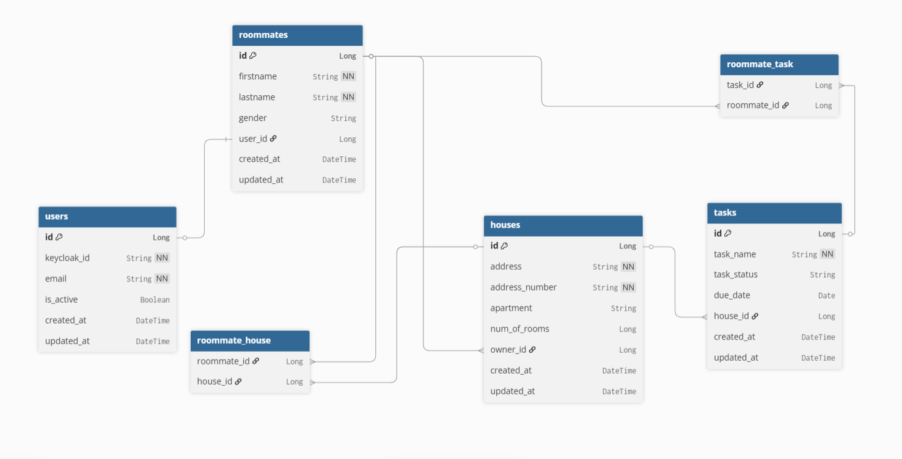

# roomies-RestAPI
## 📋 About
A REST API for managing roommates and household tasks built with Spring Boot and authentication/authorization through Keycloak.

## 🛠️ Tech Stack
- Java 21
- Spring Boot 4.0.3
- Spring Security + Keycloak
- Spring Data JPA / Hibernate
- MySQL
- Lombok
- Gradle

## 📸 Screenshots
**ER Diagram**
<table border="0" cellpadding="0" cellspacing="0">
<tr>
<td></td>

</tr>
</table>
